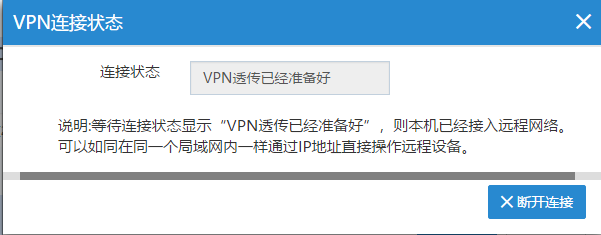
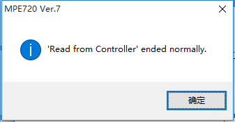

#### **FBox-4G-VPN透传-安川MP2300**  

测试环境  
操作系统：win10 64位  
软件：MPE720 Ver.7  

1.首先设置FBox-4G上线  
使用最新版FS软件，设置使用“GPRS/3G/4G远程连接”，任意固定ip即可，用USB下载到FBox-4G中  

  

2.准备好4GSIM卡（大卡），网络支持4G（移动/联通/电信）、3G（移动/联通）、2G（移动/联通），卡槽边上按钮弹出卡槽，将卡插入卡槽中，使用4G专用天线，上电等待RF灯常亮  

  

3.启动“FlexManager”客户端，客户端显示FBox-4G已经上线后，点击“远程下载”，使用“VPN透传”  

  

  

确认该FBox没有其他人使用后，点击“确定”  

  

输入和现场PLC同网段的IP，点击“连接”，例如PLC的IP地址是192.168.1.1，我们在VPN里设置的IP为192.168.1.20，只要同网段且不与现场冲突的IP即可。  

  

等待连接状态显示“VPN透传已经准备好”即可。启动VPN后，可能会弹出一个命令行窗口，如下图，直接最小化即可，不要关闭此窗口。  

  

4.确认VPN虚拟网卡  

  

以TAP开头的名称的，即为VPN虚拟网卡，如果显示“未识别的网络”，说明VPN已可用，如果显示“网络电缆被拔出”，说明VPN是断开的。  

5.打开MPE720软件  

  

有两个地方可以打开通讯设置，即Communications Setting  

  

选择VPN使用的虚拟网卡  

  

点击Connection  

  

出现绿色横条以及左边的Online图标，说明与PLC连接已经成功  

  

点击快捷方式，即可进行程序的上传、下载及写入Flash等操作了。  
注意事项，如果此时连接不到PLC上，可在PLC上电时，让PLC自动执行一下初始化和自动配置，方法是将CPU上的拔码开关3和4拔到ON后，给PLC重新上电  

  

下载：  

  

  

  

  

上传：  

  

  

  

  

写入Flash：  

  
  
  
  
  
