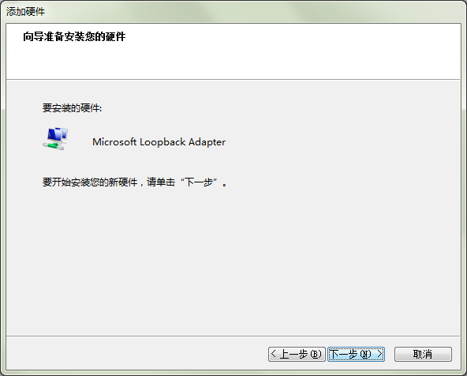
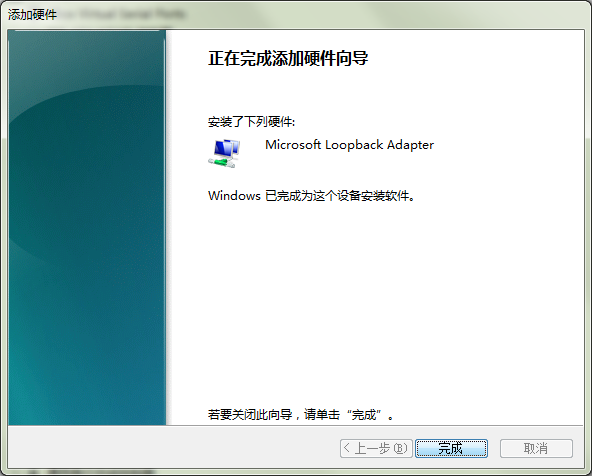
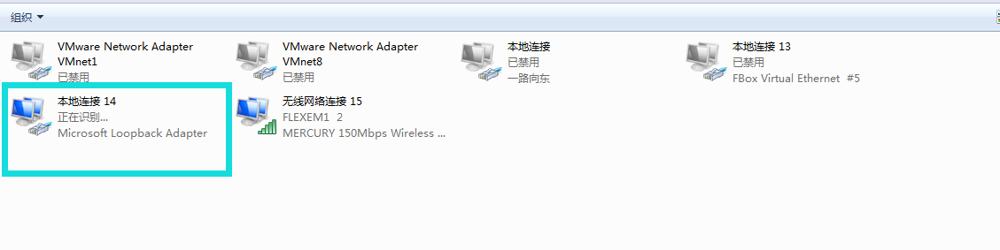

#### **WIN7下安装虚拟网卡**  

  为了确保对博图软件S7-1200以太网plc的透传成功，需要在win7电脑上安装虚拟网卡。（虚拟网卡只需要安装一次，以后就不需要安装，就可以直接使用了）  

1）在计算机，设备管理器里，操作—添加过时硬件  

  

2）单击“下一步”  

  

3）手动从列表选择硬件，然后单击“下一步”  

  

4）选择网络适配器  

  

5）让电脑自动搜索  

  

6）厂商选择“Microsoft ”，网络适配器选“Microsoft Loopback Adapter”，单击“下一步”  

  

7）单击“下一步”，然后开始安装驱动  

  

8）驱动正在安装  

  

9）驱动安装完成  

  

10）安装完成后，会在网络连接中，多出这个虚拟网卡网络设备  

  

#### **博图软件透传步骤**  

1、先设置虚拟网卡的IP地址为PLC的IP地址,注意：其中，192.168.1.223就是1200plc的IP地址  

  

2、用最新的fs给盒子下载 程序，然后使用最新的客户端，在对应的plc里，点透传按钮  

  

3 、等待界面提示透传成功，如图，客户端这时已进入透传就绪状态  

  

4 打开plc软件，编译好工程，确保软件里设置的IP跟透传的1200PLC的IP一样，点下载按钮后，将出现如下的界面里，操作如下：  
**注意：请先双击设备组态，才可以点击下载按钮！**  
  

5、点击下载按钮后，按下图所示设置  

  

6、点击空白处后，请耐心等待PLC连接上，直到下载按钮可点  

  

等待连接成功后，点击下载即可弹出如下窗口  

  

**注意：点击下载后，如果长时间停留在此下载页面的“装载组态”环节，请到盒子客户端点击结束透传，再点开始透传即可**  

  

下载完成后，如果有下图所示的提示出现，请记得勾选，否则下载透传前必须要重启PLC才可以再次透传！  

  

9、上传plc程序操作和下载plc的步骤一样，关键就是在点下载或上传的，弹出的框里，输入好IP地址就可以了。
