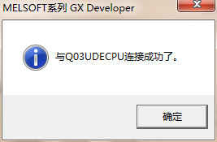

#### **设置以太网通讯IP**  

1、打开三菱软件，点击左边导航“参数”里的“PLC参数”，，再在弹出窗口里选择“内置以太网板设置”，输入通讯的IP地址  

  

3、点击开启设定，序号1里，设置协议：TCP，打开方式：MC协议，本站端口号：0401。  
序号2里，设置协议：TCP，打开方式：Socket通讯，TCP连接方式：Fullpassive，本地端口号0401，通讯对方IP地址：输入本机的IP，通信对方端口号：0401  

  

3、点击菜单栏的“在线”，选择“传输设置”弹出如下窗口  

  

双击“串行USB”，选择USB方式，确定。双击CPU模块，确定。双击不指定其他站，确定。保证USB通讯顺畅，点击通信测试，弹出通讯成功提示。  

4、选择“在线”-“PLC写入”将程序下载，确保三菱PLC是以太网通讯  

  

5、注意勾选：“参数+程序”，点击执行即可  

  

#### **在确保PLC是以太网通讯后，就可以设置透传参数**  

1、点击菜单栏的“在线”，选择“传输设置”，弹出如下窗口  

  

2、选择“以太网板”，在以太网板里选择协议为TCP，确认  

  

3、选择CPU模块，在弹出窗口里设置IP地址。注意：这里的IP是盒子客户端本机的IP地址  

  

4、选择“不指定其他站”，在弹出窗口里，直接点击确认。  

  

5、打开盒子客户端，在远程下载里，选择三菱Q的“透传”，待透传准备好，即可点击PLC软件里的通讯测试，通讯测试OK后，确认即可  

  

确保点击通信测试连接成功。如下图：  

  

注意：最后一定要点确认，不能点击关闭，否则设置都不会保存。  
此时即可透传啦！PLC读取、PLC写入、监视  

  
