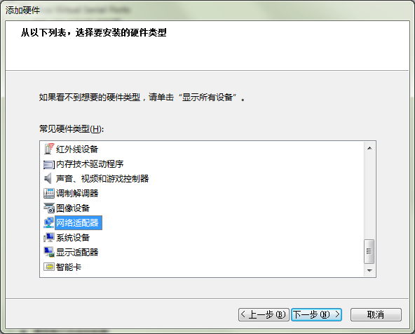

#### **准备工作，安装虚拟网卡**  

使用PowerPro V4软件对以太网plc透传下载程序，需要在电脑上安装虚拟网卡，本例中以WIN10 64位操作系统来演示，其它操作系统类似。（虚拟网卡只需要安装一次，以后就不需要安装，就可以直接使用了，另外，本虚拟网卡可能会影响VPN功能的使用，因此使用VPN功能时，请禁用或卸载此网卡）  

1）在计算机，设备管理器里，操作—添加过时硬件  

  

2）单击“下一步”  

  

3）手动从列表选择硬件，然后单击“下一步”  

  

4）选择网络适配器  

  

5）让电脑自动搜索  

  

6、 厂商选择Microsoft ，网络适配器选:Microsoft KM-TEST环回适配器，下一步
（注意：WIN7，XP等系统里，可能显示的是：Microsoft Loopback Adapter，如果是这个名称，则后续的步骤里，均会显示这个名称）  

  

7 、点下一步，然后开始安装驱动  

  

8 、驱动正在安装  

  

9 、驱动安装完成  

  

10、安装完成后，确认驱动安装的正确，设备名称左边的图标上没见有问号，感叹号等表示不正常的标识  

  

11、打开网络连接，会在网络连接中，多出这个虚拟网卡网络设备  

  

#### **PowerPro V4软件透传步骤**  

1.先设置虚拟网卡的IP地址为PLC的IP地址,其中，192.168.11.11就是LK207这个PLC的IP地址  

  

2.在FlexManager里面，添加LK207的PLC  

  

  

  

**注意：LK的编程端口号为1200，所以这里端口号必须设置成1200。且该设置只作为透传编程使用。正常读写数据需另外再添加一个端口为502的设备，其他配置和上图相同**  

**注意：修改完PLC配置后，FBox需要重启生效，此时会离线一会，稍等FBox会再次上线**  

3.设置FBox的LAN IP地址，以与PLC能够建立通讯，注意FBox的LAN IP地址，要与PLC在同一个网段且IP地址不同：  

  

保存时，会提示需要重启FBox  

  

FBox再次上线后，点击PLC后面的“透传”按钮  

  

等待界面提示“透传已准备好”，如图，客户端这时已进入透传就绪状态  

  

首先确定PLC钥匙开关在“REM”状态。打开PowerPro V4软件，编译好工程进入“通讯参数”确保软件里设置的IP跟远程的PLC的IP一样，点“在线”＞“登录”后，将出现更新程序确认对话框，点击“是”更新PLC程序。（注：如果不能登陆PLC，需要将PLC上的要是开关打到RUN后再打到REM状态，然后让FlexManager重新进入透传状态即可。）  

  

  

  

  
