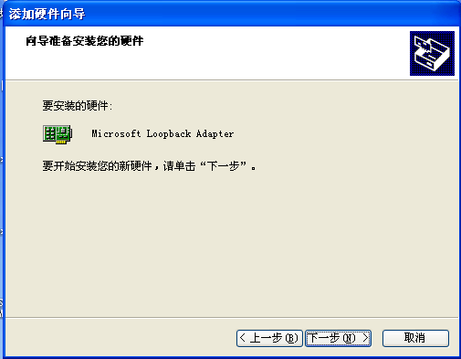

#### **WIN7下安装虚拟网卡**  

**注意：如在XP下操作，请跳过此章节，直接跳往下一章XP下安装虚拟网卡的步骤**  

  为了确保对博图软件S7-200以太网模块plc的透传成功，需要在win7电脑上安装虚拟网卡。（虚拟网卡只需要安装一次，以后就不需要安装，就可以直接使用了）  

1）在计算机，设备管理器里，操作—添加过时硬件  

  

2）单击“下一步”  

  

3）手动从列表选择硬件，然后单击“下一步”  

  

4）选择网络适配器  

  

5）让电脑自动搜索  

  

6）厂商选择“Microsoft ”，网络适配器选“Microsoft Loopback Adapter”，单击“下一步”  

  

7）单击“下一步”，然后开始安装驱动  

  

8）驱动正在安装  

  

9）驱动安装完成  

  

10）安装完成后，会在网络连接中，多出这个虚拟网卡网络设备  

  

#### **XP下安装虚拟网卡**  

1）控制面板-添加硬件  

  

2）单击“下一步”  

  

3）在出现的弹框中，选“是，我已经连接了此硬件”，然后单击“下一步”  

  

4）选择添加新的硬件，然后单击“下一步”  

  

5）选择如图，从列表安装，然后单击“下一步”  

  

6）选择网络适配器，再“下一步”  

  

7）选择厂商为“Microsoft”，网卡为“Microsoft Loopback Adapter ”，然后单击“下一步”  

  

8）如图，点“下一步”即可安装  

  

9）安装虚拟网卡完成  

  

10）安装完成后看到如下设备  

  

#### **S7软件对s7-300以太网plc透传步骤**  

1）先设置虚拟网卡的IP地址为PLC的IP地址,其中，192.168.100.249就是plc的IP地址。  

  

2.用最新的fs给盒子下载 程序，然后使用最新的客户端，在对应的plc里，点透传按钮  

  

3.等待界面提示透传成功，如图，客户端这时已进入透传就绪状态  

  

4.打开plc软件，编译好工程。（建议工程里设置的IP和当前PLC的IP一样，如果工程里IP有改变，会在下载工程后，由于PLC的IP变成工程里的IP，就需要盒子重新下载组态程序）点下载按钮后，在出现 如下的界面里，操作如下：  

  

5.点下载 按钮后，出现的弹框里，输入PLC的IP地址，192.168.100.249，这个IP地址也就是虚拟网卡的IP地址。输入好IP后，即可点OK继续操作，如果有提示这些类似信息，表示透传已经建立，plc软件可以和PLC连接，此是可以下载了。

  

6.plc软件下载 plc过程 ：  

  

7.下载完成后，plc软件会提示是否启动运行plc，这时候用户可自行操作即可。  

  

8.上传plc程序操作和下载plc的步骤一样，关键就是在点下载或上传的，弹出的框里，输入好IP地址就可以了。  
