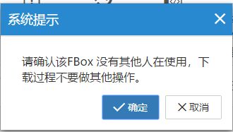

#### **FBox-4G-VPN透传-繁易触摸屏,以及VNC**  

测试环境  
操作系统：win7 64位  
软件：FS1.0  

1.首先设置FBox-4G上线  
使用最新版FS软件，设置使用“GPRS/3G/4G远程连接”，任意固定ip即可，用USB下载到FBox-4G中  

  

2.准备好4GSIM卡（大卡），网络支持4G（移动/联通/电信）、3G（移动/联通）、2G（移动/联通），卡槽边上按钮弹出卡槽，将卡插入卡槽中，使用4G专用天线，上电等待RF灯常亮  

  

3.启动“FlexManager”客户端，客户端显示FBox-4G已经上线后，点击“远程下载”，使用“VPN透传”  

  

  

  

  

4、打开触摸屏软件，点击下载按钮，手动输入屏的IP地址，点击下载即可  

  

VNC设置以及使用（用远程的电脑显示现场触摸屏的组态画面）  

1.打开触摸屏软件，窗口中鼠标右键单击，进入“窗口属性”，选择“动作与功能”选项卡，点击“添加”，选择“窗口初始化”，打开“执行位设定”。  

  

2.点击“系统寄存器”，找到“VNC相关”，选择SRB10020，初始化置ON即可，完毕后将工程下载到屏中  

  

3.下载安装VNC电脑客户端，比如RealVNC，启动VNC Viewer，输入触摸屏的IP，点击“Connect”，密码为空即可  

  
  
  
