#### **西门子300COM口透传**  

透传前，请先打开以上FS设置的COM口的透传窗口!  

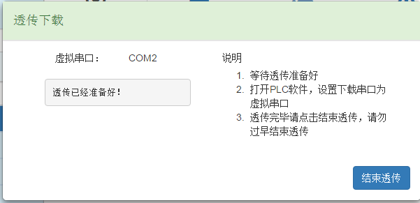  

西门子200的透传主要设置左侧导航的三个属性，见下图  

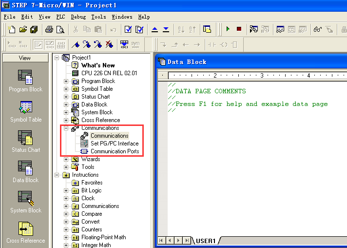  

点击左侧导航的Communications—SetPG/PC Interface，在弹出的窗口里选择PC/PPI cable（PPI），最后再点击属性  

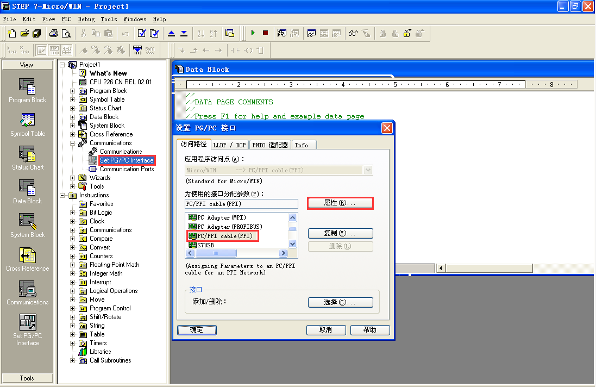  

点击属性后弹出如下窗口，按照红色区域所示，选择相应选项  

  

注意：这里的COM2，为透传时提示的虚拟串口  

  

#### **Communication Ports**  

这里的Port口的波特率最好都选择9.6kbps波特率，这样可提高透传的成功率。  
**注意：PLC的波特率在透传之前，一定也要是9.6kbps，如果不是，则透传不会成功。**  

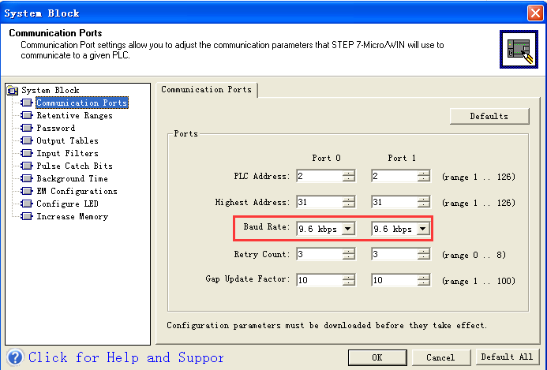  

点击左侧导航的Communications—Communications，双击Connect Phone Number  

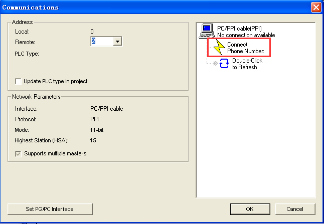  

在打开的窗口里，点击Settings...  

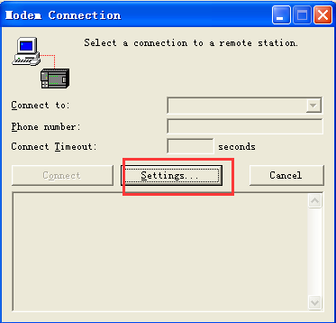  

再在弹出的窗口里点击Add...  

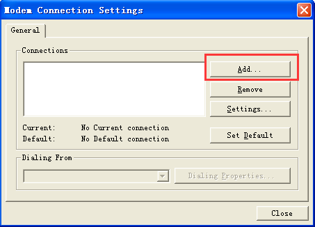  

输入一个连接的别名，再点击Configure...  

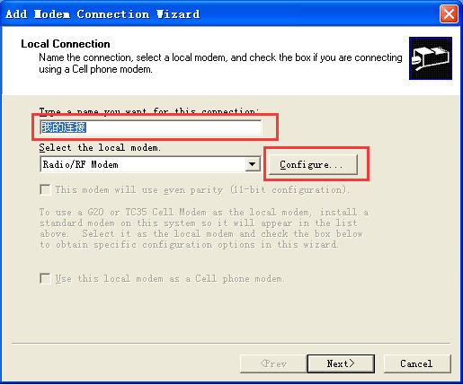  

5、输入虚拟串口2，Parity位Even，OK即可  

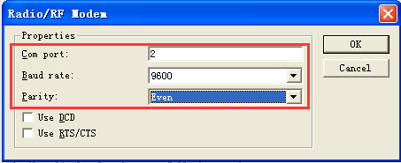  

当再次回到下图所示页面时，点击Connect，等待连接成功  

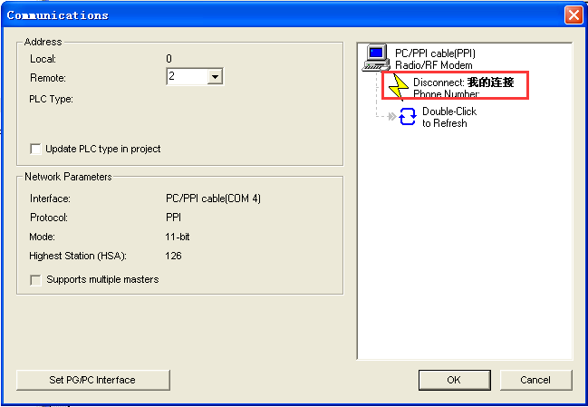  

点击Double—Click to Refresh，查找到PLC即可透传  

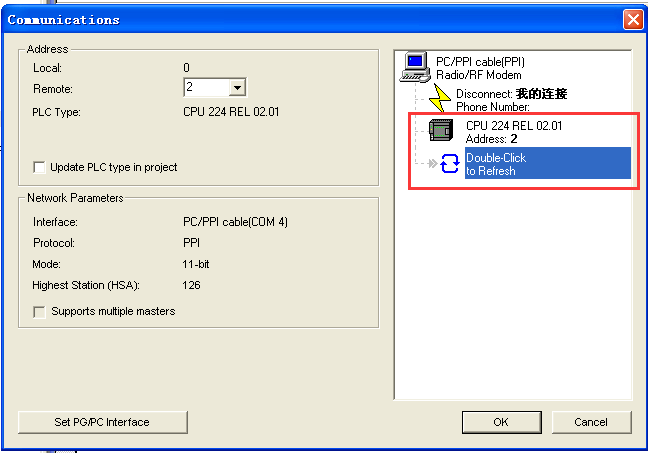  
