#### **FBox-4G-VPN透传-施耐德TM218**  

测试环境  
操作系统：win7 64位  
软件：SoMachine4.1  

1.首先设置FBox-4G上线  
使用最新版FS软件，设置使用“GPRS/3G/4G远程连接”，任意固定ip即可，用USB下载到FBox-4G中  

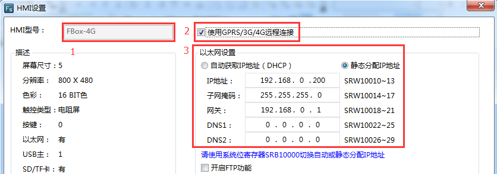  

2.准备好4GSIM卡（大卡），网络支持4G（移动/联通/电信）、3G（移动/联通）、2G（移动/联通），卡槽边上按钮弹出卡槽，将卡插入卡槽中，使用4G专用天线，上电等待RF灯常亮  

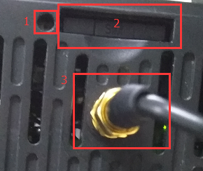  

3.启动“FlexManager”客户端，客户端显示FBox-4G已经上线后，点击“远程下载”，使用“VPN透传”,输入和现场PLC同网段的IP，点击“连接”，等待连接状态显示“VPN透传已经准备好”即可。例如PLC的IP地址是192.168.11.11，我们在VPN里设置的IP为192.168.11.21，只要同网段且不与现场冲突的IP即可  

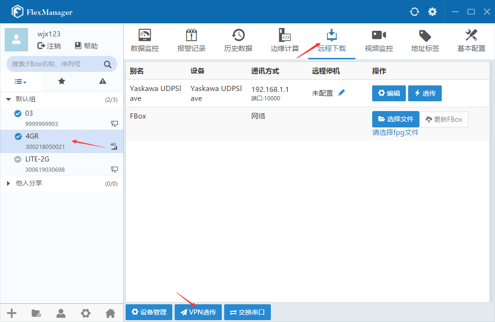  

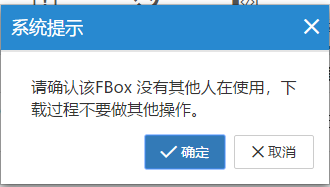  

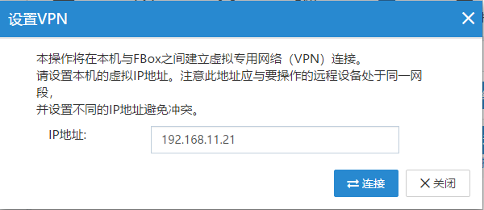  

  

4.打开PLC软件，右键单击“MyController”，选择“更新设备”，在弹出窗口中点击“更新设备”，等完毕后点击“关闭”。在通讯设置选项卡中选择“添加网关”，按照默认设置确认，双击“Gateway-1”，会刷新出plc，并显示为活动的，这时可以点击登录plc，执行下载即可  

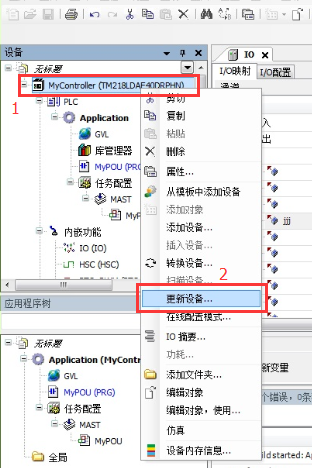  

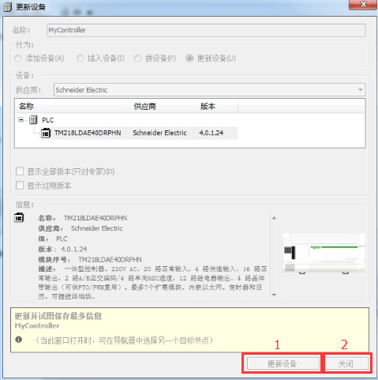  

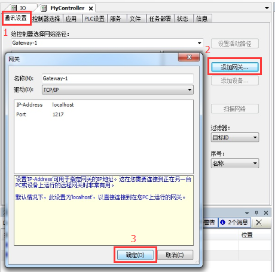  
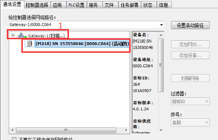  
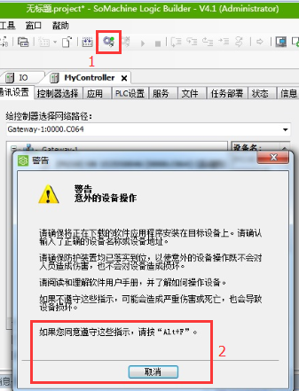  
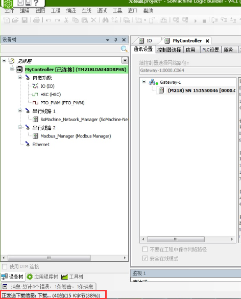  
