#### **西门子300COM口透传**  

FS里专门预留一个COM口，设置透传的通讯参数,透传前，请先打开下图FS设置的COM口的透传窗口!  

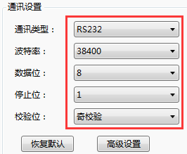  

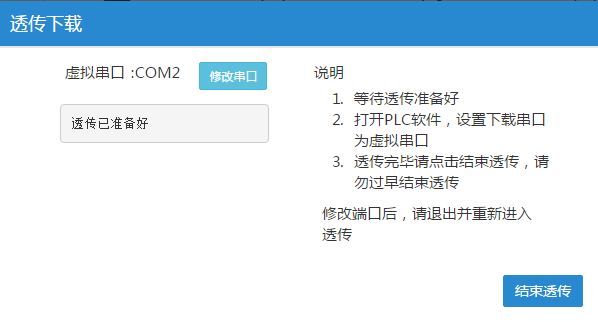  

打开300PLC软件，选择Options—Set PG/PC Interface...，选择MPI方式，打开属性窗口，设置COM口为盒子客户端显示的虚拟串口，透传参数38400.  

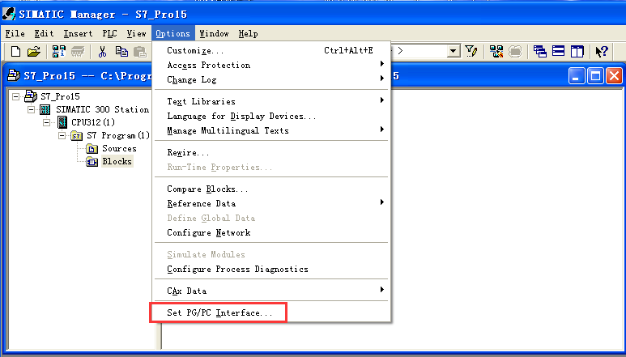  

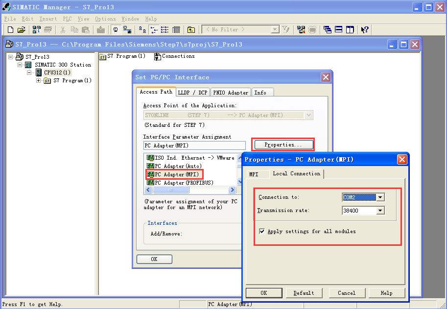  

设置好下载参数后，点击已经建好的CPU型号，双击，再点击Connections，在打开的弹出窗口里，选择上传  

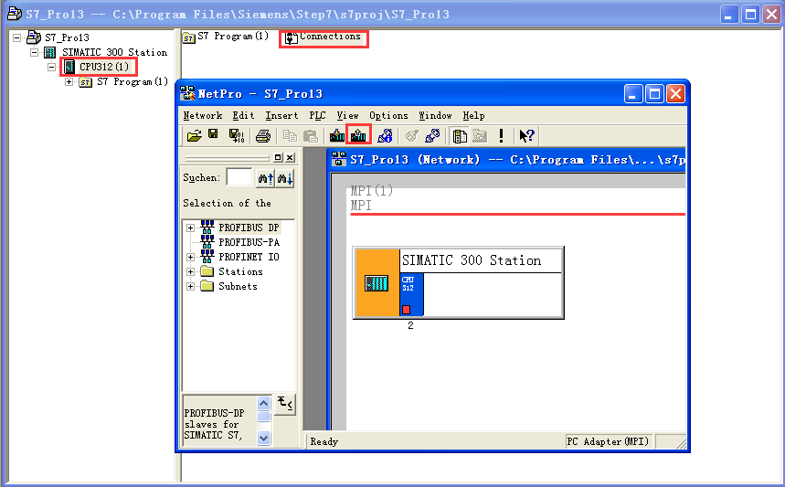  

在打开的窗口里，选择Update，查找到CPU后，点击OK,此时就可以透传啦！  

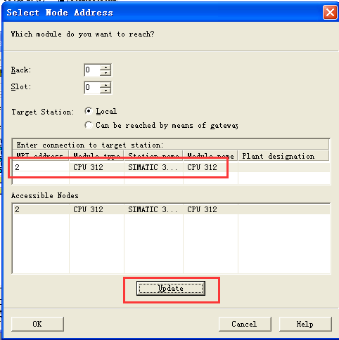  

#### **VIGOR 系类PLC透传步骤说明**  

透传注意事项:  

**经测试发现VS1—20MT可以直接通过485线直连，VS1—32MT需要使用485转232的转换器（如下图所示）才可以和电脑直连，所以透传的时候也是这样，VS1—20MT可以直接透传，而VS1—32MT需要使用转换器才可以**  

建议客户透传时可以先尝试选择485线透传，如果不可以透传，再使用转换器。  

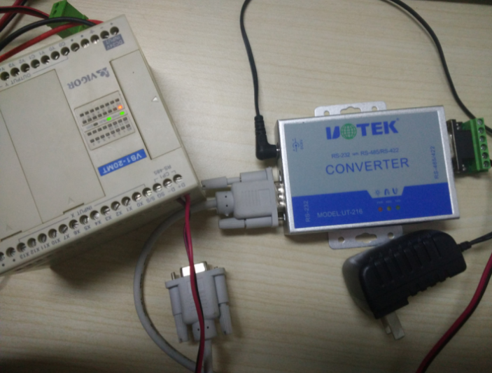  

**注意：使用485线透传时，Fbox客户端通讯类型请使用485，使用485转232时，通讯类型请使用232**  

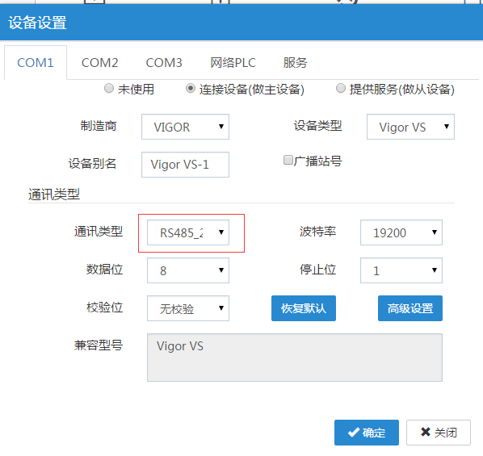  

#### **FlexManager准备**  

选择对应的驱动，点击透传，待透传准备好  

  

PLC软件设定  
1、打开PLC软件，选择菜单栏—系统设定下的联机方式设定  

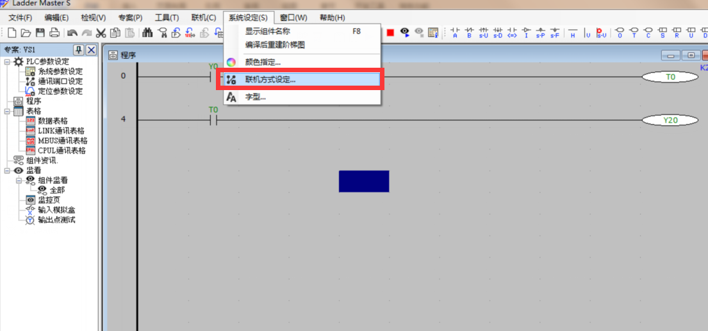  

2、选测联机方式为COM Port,通讯端口为对应Fbox客户端显示的虚拟串口确定即可  

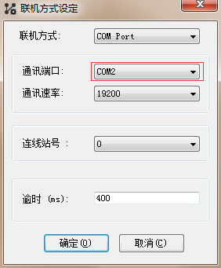  

3、端口选好后，点击菜单的联机，从PLC读取专案，成功，即代表可以透传，读写PLC，监控PLC都可以了  

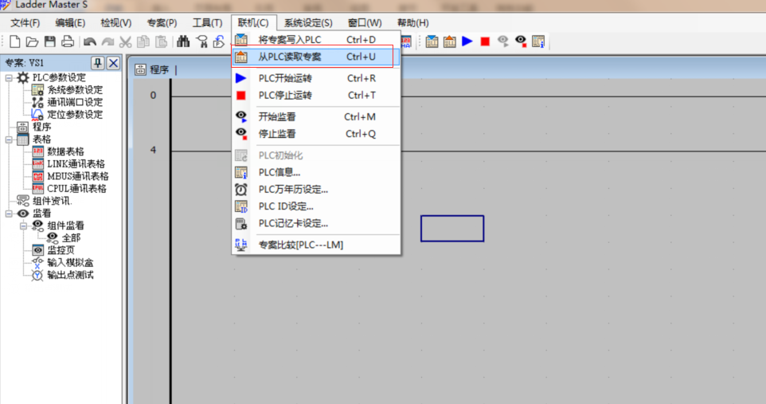  
