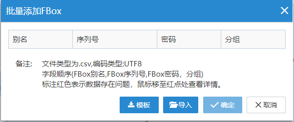
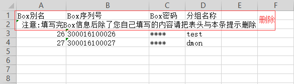

#### **批量添加盒子**  

用户可以根据模板，填写CSV文件，进行批量添加盒子  

在设备管理区域，点击,选择“批量添加盒子”，如下图所示  

  

可以点击“模板”按钮，在下载的CSV模板中编辑将要批量添加的盒子。点击“导入”按钮，选择编辑好的CSV文件，点击“确定”完成添加。  

**注意：导出CSV文件，如果用EXcel编辑，注意需要另存为.csv格式，再导入**  

  