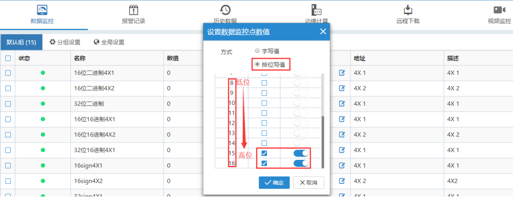
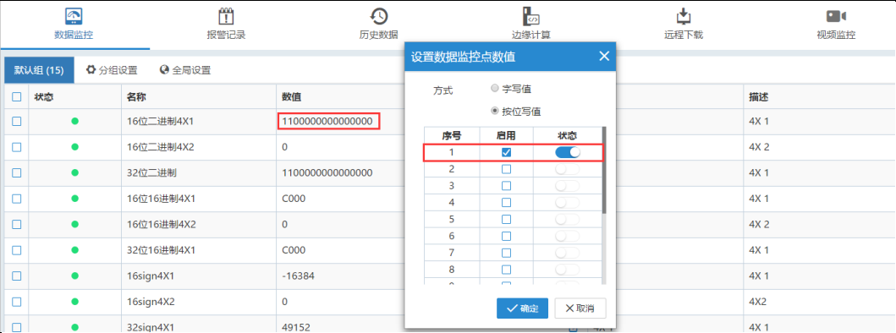
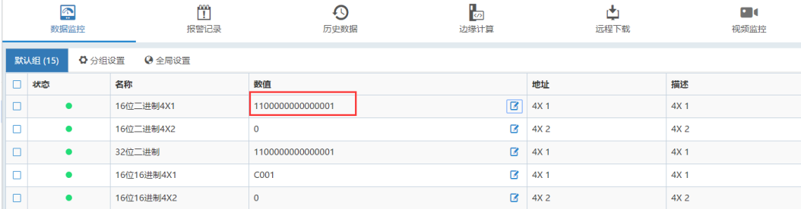

#### **字地址对位独立写值**  

**升级盒子固件至最新**  

字地址中选择“按位写值”，对希望修改的位勾选“启用”，“开”状态为“1”，“关”状态为“0”。  

  

**注意：**  

按位写值值针对勾选“启用”的位进行写值，对于没有勾选的位，它们的值是不变的。  

例如：  

“16 位二进制 4X1”的值现在是:11000000 00000000现在只对它的低位进行写值：  

  

写值之后的值是:11000000 00000001  

  