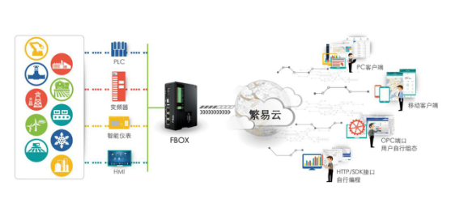

### **FBox介绍**  

**繁易盒子（Flexem Box）简称FBox，是繁易工业物联网平台FlexManager中的一种工业互联网智能传输终端设备。**  

#### **FlexManager系统**  

**FlexManager系统，也称繁易云，通过互联网（以太网、GPRS、3G等），将现场的大量不同区域工业设备的数据或者程序，传输到远端的云数据中心，实现远**  

**程数据监控，设备诊断、程序维护和故障报警等功能，为用户提供一种简单可靠的工业互联网数据远程传输方案。**  

**FlexManager系统的组成：**  
  
| 组成部分 | 说明 |
|   - |  :- |
|设备端|FBox 和所连接的设备控制器、HMI和仪表等。|
|服务器端|繁易云服务器群或用户自建私有云服务器。|
|客户端|PC客户端/WEB客户端，手机APP，以及OPC/SDK等|

**FlexManager系统的各组成部分之间的关系如图：**  

  

**在FlexManager系统中，云端服务器用于连接现场的大量FBox设备，实现大量远程设备的连接管理、数据采集、存储和传送等功能，是FlexManager系统的中枢。**  

**FBox设备是现场设备与用户客户端连接桥梁中的智能传输终端，负责将工业现场设备连接至云端服务器。**  

**FlexManager功能具有以下特点：**  
  
- 支持网线、GPRS和4G连接，无需复杂配置，应用简单方便；  

- 支持绝大部分PLC远程程序下载和监控，减少用户出差；  

- 支持VPN，一键连接，简单方便;  

- 支持通过电脑客户端、手机APP和网页远程数据监控；  

- 支持数据报警，移动端APP可推送报警信息，也可配置短信推送和微信推送；  

- 支持历史数据记录，采集和记录登记的监控点的数据，并支持列表曲线的数据展示和常用的统计分析；  

- 支持远程停机功能，绑定盒子与PLC的连接，远程控制停机，便于租赁设备等的远程设备管理；  

- 接口开放，支持OPC接口，用户可自行组态；同时开放HTTP接口和SDK接口，用户可自行编程；  

- 支持权限分级，可以根据实际情况分配不同权限的账户信息，便于设备厂商和终端客户使用。  

#### **FBox设备**  

**FBox设备是繁易最新推出的物联网平台（FlexManager）中的远程通讯设备，可以方便地实现现场设备的远程互联、远程下载和远程维护。**  

FBox设备有六种类型：FBox、FBox-VPN、FBox-2G、FBox-4G、FBox-2G-lite、FBox-WiFi。其中FBox以太网版不带天线插口。  

在FlexManager系统中，云端服务器通过FBox设备将远程客户端与工业现场设备紧密联系起来。FBox设备基于ARM CORTEX A8处理器内核，具备3个以太网口，3个串行通讯口，具备WIFI/GPRS/4G等多种无线设备的互联能力。在实际应用中，将FBox产品安装在现场机柜中，通过串口或者以太网口连接不同型号的PLC、智能仪表或者变频器等设备。FBox产品通过上网，将这些PLC或仪表中的数据发布到互联网云服务器中。均可以随时查看分布在各地的设备数据、了解设备运行状态和报警、远程调试PLC、摄像头监控等功能。  

通过FBox及远程客户端软件，用户可以方便地通过互联网远程更新PLC及人机界面程序，查询分析现场数据，获取现场数据分析问题，远程维护配置；可以通过摄像头查看实时画面，可以更方便地收集现场的运行数据，做出故障报警，维护预警，并根据收集的数据做出改进反馈，以便更好地优化产品。  

FBox设备可广泛应用于空调、供水、楼宇、供暖、冷库、实验设备、空压机、包装、印刷、纺织、租赁设备、环保设备和无人泵站等各行各业。  

**FBox设备的特点如下所示：**（ FBox-2G-lite版除外）  

- ARM CORTEX A8 高速CPU；  

- 内置网络交换机，支持3以太网接口，方便现场组网；  

- 多种无线互联方式：可选WIFI/GPRS/4G支持；  

- 三路串行通讯口： COM1（RS232/RS485/RS422）、COM2（RS485）和COM3（RS232）；  

- 2路光电隔离数字输入，2路继电器输出；  

- SD卡，USB HOST支持16G外部存储SD卡或U盘；  

- USB SLAVE下载配置，调试程序。  

#### **FBox客户端**  

**对FBox设备进行访问或操作，需要使用FBox客户端。**  

FBox客户端分为PC客户端、WEB客户端和手机客户端（安卓App和IOS App）。PC客户端可实现远程监控下载、数据读写、故障报警、视频监控和历史数

据记录等；WEB客户端可通过浏览器直接访问或跨平台访问，但不支持远程下载；手机客户端支持Android（安卓）或IOS系统，可实现报警推送，但不支持远程下载。  

在FBox客户端，需要安装相应的软件才可以访问FBox设备。  

FBox客户端软件（FlexManager）分为PC客户端软件和移动客户端软件（FBox手机APP）。PC客户端软件在PC端使用，实现设备的远程监控，下载、数据读

写、故障报警、视频监控和历史数据记录等。移动客户端软件安装于手机等设备移动端，可以实现数据读写、故障报警和历史数据记录等功能。  

这些软件可前往 **http://www.flexem.cn** 网站中进行下载。