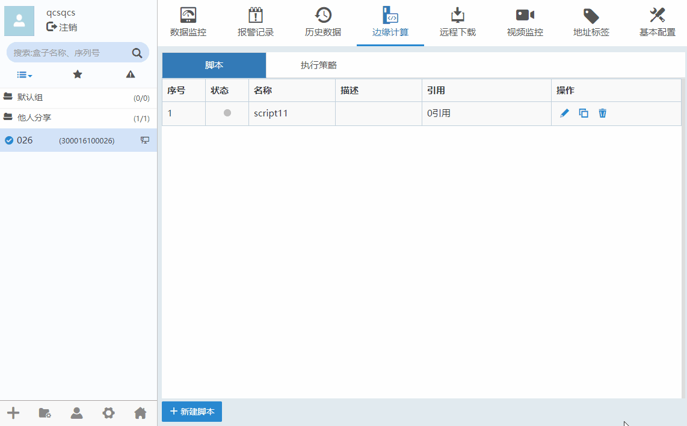
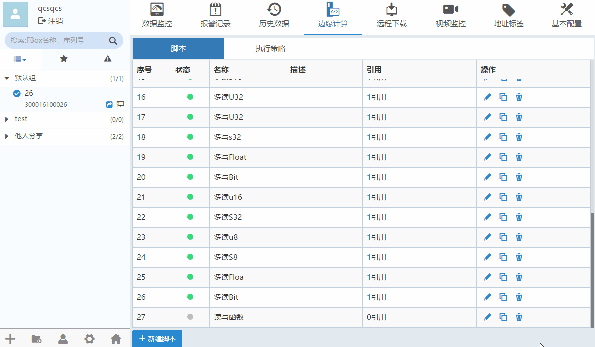

#### **边缘计算**  

使用边缘计算，可以单独针对每一个设备进行相应的计算和分析。一旦设备或者参数相同，还可以复制使用同一套计算标准或算法。此外，将计算脚本开放出来给用户，用户就可以自定义去添加自己的计算公式和行为。  

#### **新建脚本**  

边缘计算”-->“脚本”，点击“新建脚本”，点击新建变量。如下图所示。  

  

点击修改脚本，点击可以删除脚本。  

编写完脚本之后，用户可以点在说明右侧的小三角调试图标，先运行一遍查看是编写是否有误。下方的“输出”与“监控”窗口可以看到调试效果，确认无误后，点击右下方的保存并关闭
按钮。  
这个图标是运行的功能，点击这个功能可以把程序模拟运行一遍。  
这个图标是单步运行功能，执行在当前一行的指令。  
点击运行选项之后，下方的输出和监视窗口会出现信息。  
输出窗口显示的是各个变量的输出值。  
监视窗口显示的是各个变量的地址偏移量和具体数值。  

完成脚本之后，需要设置盒子的执行。请看[执行策略](ExecutionStrategy.md)  

#### **在线文档**  

在右上方的帮助选项中，有基础的一些指令和具体例子供用户参考学习。  

点击修改脚本或点击“新建脚本”按钮。点击“帮助”。如下图所示。  

  
