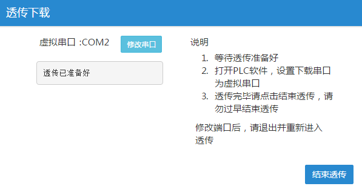

## **透传下载**  

透传，就是透明传送，即传送网络只负责将需要传送的业务传送到目的节点，同时保证传输的质量即可。  
透传下载，可以做到直接使用PLC编程软件进行程序的在线监控、上传和下载等。  

#### **串口透传下载**  

将PLC通过串行接口直接连接到FBox，远程计算机可以通过以太网络直接下载至PLC。  
（1）在FlexManager客户端软件的“远程下载”选项中，选择相应的需要透传的设备，点击“透传”按钮，弹出系统提示框  
  

（2）点击“确定”按钮，显示串口透传下载窗口，电脑首次进行透传操作时，会提示安装驱动  
  

点击安装驱动按钮进行虚拟串口驱动安装，此时会自动调出FBox虚拟串口工具，如下图所示。选择安装虚拟串口的串口号，点击确定，等待自动安装寻串口。可能需要几分钟的时间。等待安装完成后点击确定，此时看到驱动安装完成后点击退出。  

  
  

此时需要重启FlexManager软件，重启软件后进入透传界面即可看到透传通道已经准备好。  
**注：有些电脑安装虚拟串口的驱动是不能自动打开虚拟串口安装工具的，可以手动安装，具体路径在：C:\Program Files (x86)\FBox\FlexManager 1.0\drivers，如图4.9-5。选择对应系统所需要的驱动安装，可能需要电脑禁用防火墙，以管理员身份运行。**  

  

显示透传已准备好后，即可打开PLC软件进行程序的上传或者下载，其中PLC通信口需要选择透传时创建的虚拟串口号，如图，此时选择通信串口为COM2。  

  
等待显示“透传已经准备好”后，即可打开PLC编程软件。  
（1）在PLC软件下载设置中，设置串口号为刚才客户端软件显示的虚拟串口号；波特率等串口参数设置与FBox以及实际PLC一致。  
（2）设置完成后，可以直接点击PLC的下载（也可以是上传或连接）按钮对PLC进行操作。  
（3）下载完成后，回到FlexManager客户端软件的串口透传下载窗口，点击“结束透传”按钮，弹出系统提示框，如图所示。点击“确定”按钮，结束透传。  

**注：假如显示“透传已准备好”，请继续操作；假如显示“获取透传数据失败”，请关闭透传后，刷新页面，再次点击透传按钮尝试。**  

长时间打开透传通道不进行数据上下载透传通道可能会断开。请在需要修改PLC程序时才打开透传通道。  
  

#### **以太网透传**  

将PLC通过以太网接口直接连接到FBox，远程计算机可以通过以太网络直接下载至PLC。  
（1）在FlexManager客户端软件的“远程下载”选项中，选择相应的需要透传的设备，点击“透传”按钮，弹出系统提示框。  
（2）点击“确定”按钮，显示以太网透传下载窗口，如图所示。显示的本地端口号如果与设备连接时所配置的端口号不一致，则需要点击“修改端口”，使二者保证一致。一般情况下使用默认端口号即可。  

  

（3）等待显示“透传已经准备好”后，打开PLC编程软件。  
（4）在PLC编程软件中，设置PLC设备的IP地址为本机的IP地址，而不是远程PLC的IP地址。以Smart PLC为例： 本机的IP地址是192.168.100.200，则在添加PLC时输入本机IP地址为192.168.100.200。  

  

**注：此时必须选择添加CPU而不是查找CPU**  
（5）设置完成后，即可进行下载（也可以是连接或上传）操作。不同的PLC设置不一致  

（6）下载完成后，回到FlexManager客户端软件的以太网透传下载窗口，点击“结束透传”按钮，弹出系统提示信息，如图所示。点击“确定”按钮，结束透传。  

  

#### **VPN透传**  

**注意：只有4G盒子产品且使用4G卡上网的时候，才可以使用VPN透传功能。**  

（1）在客户端的“控制面板”中查看网络连接，保证网络连接只有一种上网方式。如有其他网络，请将其他网卡禁用，如下图所示  

  

（2）打开最新版的FlexManager软件后，选择“远程下载”选项，并点击 “VPN透传”按钮，如图所示。  
  

（3）不管哪个网络驱动透传，都可点“VPN透传”按钮，弹出提示对话框，如图所示。  

  

（4）点击“确定”按钮，弹出“设置VPN”对话框，如图所示。  

  

**注意：这里的IP地址不是PLC的IP，而是与PLC同网段的IP，作为本机的虚拟IP；该IP不能与PLC的IP冲突，如果不知道PLC的IP，则可填写一个未使用的IP；如果通过PLC扫描获取的PLC IP和VPN的IP（图4-中设置的IP）不在同一个网段，则要关掉透传通道，重新输入一个同网段的IP进行PLC的连接，即可实现上传、下载和监控功能。**  

（5）点击“连接”按钮后，弹出“VPN连接状态”对话框，如图所示。  

  

（6）如果点击“连接”按钮后出现“用户帐号控制”提示窗口，如图所示，程序名称为“iphelper”，请一定点击“是”按钮，这是透传需要的程序。  

  

（7）待出现如图所示“Sequence Completed”时，表示连接成功，可以透传了。  

  

（8）不要关闭上述任何软件，并打开PLC软件，选择电脑上网网卡，对PLC进行远程下载  
