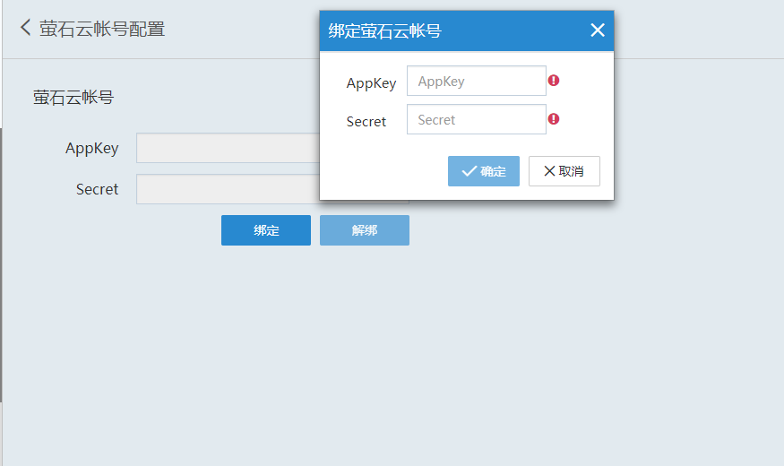

#### **1、注册萤石云账号**  

进入萤石云官网（www.ys7.com），登录个人账号（如没有先注册），进入定制服务，开发者服务。  

  

在定制服务页面点击账户信息，根据提示填写相关信息。  

  

如果后期考虑升级为企业账号的请不要选择个人开发者。（企业信息请填写客户自己公司的信息）  

点击我的应用，填写应用的信息。  

  

进入应用秘钥，复制 APPKey 和 Secret 信息。  

  

在我的资源---我的设备内，点击“标准流地址”设置摄像头直播。  

  

在此处设置开启、暂停、关闭直播，如果在客户端中摄像头没有直播，需要检查这里摄像头直播是否处于“直播中”状态。  

  

**注意**  

- 我的资源--我的设备页面下方，有视频直播的源地址，我们只支持通道1的播放  

  

- 如果视屏加密，会导致客户端的摄像头无法直播，需要在手机萤石云app登录账号，把加密关闭  

  

#### **2、 绑定萤石云账号**  

点击进入全局设置，选择“萤石账号”，点击绑定，输入 appkey 与 secret。  

  